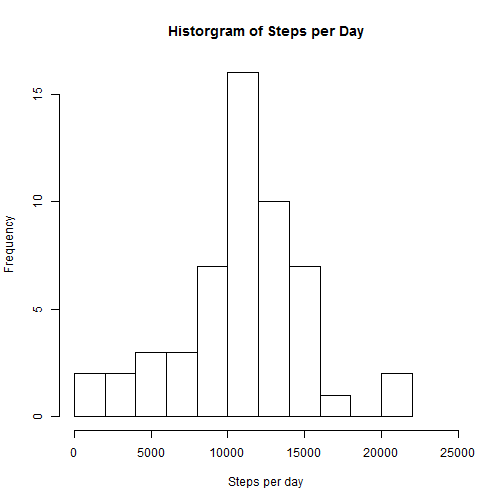
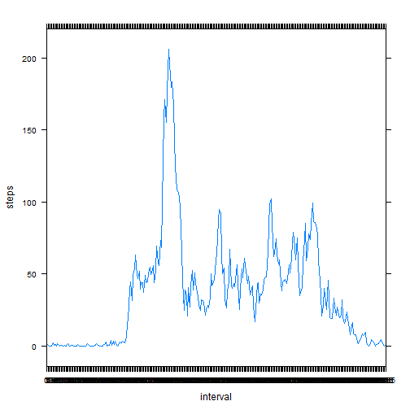
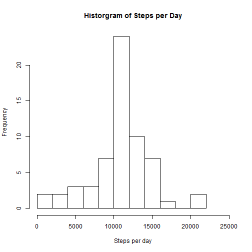
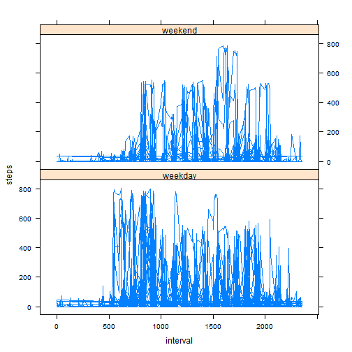
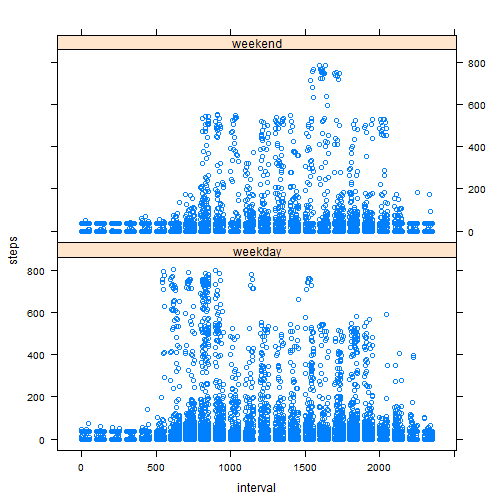

## Loading and preprocessing the data
The data file was provided as a part of the project that we forked so no need to download it. We must, however, unzip it. 

```r
unzip(zipfile = "./activity.zip");
```

Once unzipped, we can load it into a environment variable, which I propose to imaginatively name 'activity'. 


```r
activity <- read.csv("./activity.csv");
```
At this point the data is loaded and we can begin our analysis. 
<br/><br/>


## What is mean total number of steps taken per day?
The data is provided in steps per five minute segment. In order to determine the mean per day, we must aggregate the data. The most obvious way to do this is by using tapply to sum the steps indexed by the date. Take the mean and median of the resulting vector and you have it.


```r
sumbyday <-tapply(activity$steps, activity$date, sum, simplify = T);
mean(sumbyday, na.rm = T);
```

```
## [1] 10766.19
```

```r
median(sumbyday, na.rm = T);
```

```
## [1] 10765
```

Out of sheer paranoia, I attacked the problem from another angle to validate the mean. In the second pass I took the mean of steps over all the intervals and multiplied by 288, the number of five minute intervals contained in a day. You can do this with mean, but not median.


```r
mean(activity$steps, na.rm = T) *288
```

```
## [1] 10766.19
```
The answers match, I am convinced. 
Now for the histogram. The default number of breaks looked too chunky to me so I set breaks=10. I also set the xlim to 0-25,000 to make it a bit clearer. 


```r
hist(sumbyday, breaks=10, xlim=c(0,25000), xlab = "Steps per day", main = "Historgram of Steps per Day")
```

 
<br/>
It looks like a normal-ish distribution with the right tail clumped, forming a 'second hump', perhaps. Weekends? 

<br/><br/>


## What is the average daily activity pattern?
First, we have to get the data into a usable format, a dataframe with interval in the first column and the mean steps in the second. 

```r
meanbyinterval <- tapply(activity$steps, activity$interval, mean, simplify = F, na.rm=T);
df <- data.frame(matrix(unlist(meanbyinterval), nrow=288, byrow=T));
df <- cbind(factor(names(meanbyinterval), levels=names(meanbyinterval)), df);
names(df) <- c("interval", "steps");
```
After that, we can plot it.

```r
library(lattice);
xyplot(steps ~ interval, data=df, type="l");
```

 

## Imputing missing values
First, we must determine the number and proportion of NAs in the data set.

```r
sum(is.na(activity$steps));
```

```
## [1] 2304
```

```r
sum(is.na(activity$steps)) / sum(!is.na(activity$interval));
```

```
## [1] 0.1311475
```
This shows us that there are 2304 NAs, representing 13% of the observations. We then create a new dataset, activity2, that replaces the NAs with the average value. From this new data set we can re-execute the analysis above, but with the NAs replaced.

```r
activity2 <- activity;
activity2$steps[is.na(activity2$steps)] <- mean(activity2$steps, na.rm = T);

sumbyday2 <-tapply(activity2$steps, activity2$date, sum, simplify = T);
mean(sumbyday2, na.rm = T);
```

```
## [1] 10766.19
```

```r
median(sumbyday2, na.rm = T);
```

```
## [1] 10766.19
```

And create the histogram.

```r
hist(sumbyday2, breaks=10, xlim=c(0,25000), xlab = "Steps per day", main = "Historgram of Steps per Day")
```

 
<br/>
The two histograms look pretty much identical to me. The mean has not changed -- which makes sense as we added values equal to the mean of the original set -- but the median is now identical to the mean. I'm not sure why. 
<br/>
<br/>


## Are there differences in activity patterns between weekdays and weekends?
First, create a new factor variable marking each reading as weekday or weekend.

```r
activity2$date <- as.Date(activity2$date)
activity2$we <- ifelse(weekdays(activity2$date) == 'Saturday' | weekdays(activity2$date) == 'Sunday', "weekend","weekday")
```
Next, plot the data in a lattice, split by the 'we' variable.

```r
xyplot(steps ~ interval | we, data=activity2, layout=c(1,2), type="l")
```

 
<br/>
The instructions say line chart, but I find that hard to follow. I prefer this.


```r
xyplot(steps ~ interval | we, data=activity2, layout=c(1,2))
```

 
<br/>

Indeed there appears to be a difference between weekend and weekday activity. Specifically, a lot more activity earlier on weekday. That is about all I see. 


